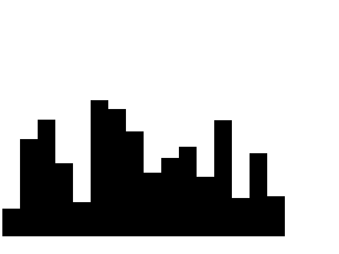

Exercise that involves drawing data from a websocket connection onto an HTML canvas

To run use `npm start`

### Task

You are provided with a websocket connection that emits (fake) data for the price of a stock every 1 second. Your task is to create a bar chart based on that data that looks like:

